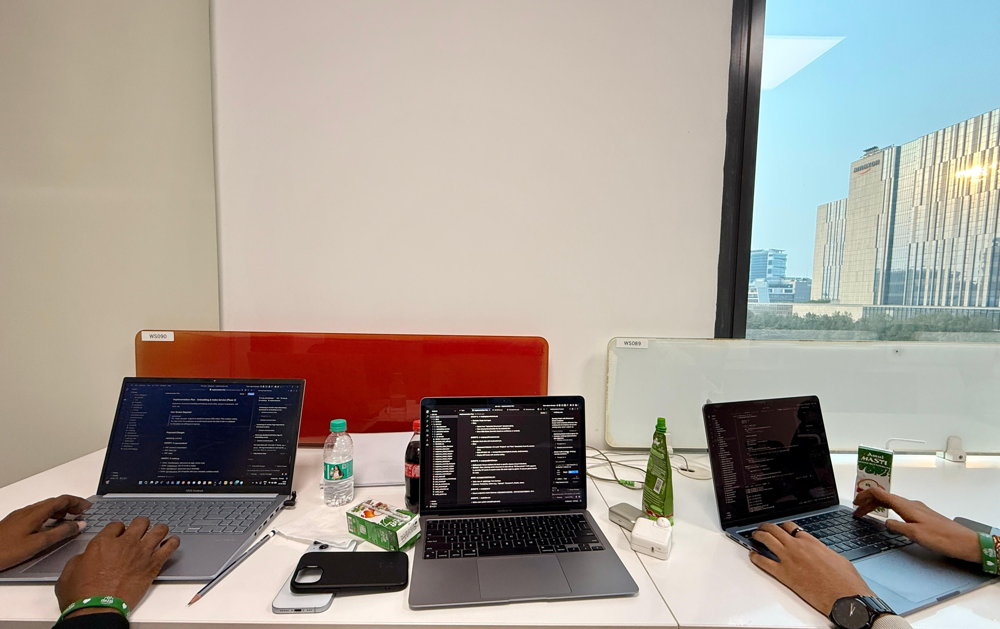

# Hey, I'm Vinesh 👋

---

## About Me

<table width="100%">
<tr>

<td width="55%" valign="middle" style="padding: 20px 30px 20px 20px;">

<ul>
<li>AI/ML undergrad with hands-on experience in CNNs, real-time inference, and data systems</li>
<li>Work across the full pipeline — data cleaning to production deployment</li>
<li>Currently deepening expertise in <strong>Python</strong> while actively learning <strong>AI/ML concepts</strong> and <strong>advanced SQL for data-driven application development</strong>, and <strong>contributing to open-source projects</strong> on GitHub.</li>
<li>Certified in Salesforce Agentforce, Google Cloud Gen-AI, and Cisco</li>
</ul>

</td>

<td width="45%" valign="middle" align="center" style="padding: 20px;">

</td>

</tr>
</table>

---

## Tech I Work With

| Domain | Stack |
|-------|-------|
| **Languages** | Python · Java · C/C++ · JavaScript · SQL |
| **Web** | HTML · CSS · JavaScript · Vite |
| **AI/ML** | Machine Learning · CNNs · OpenCV · Scikit-learn · MobileNetV2 |
| **Frameworks & Apps** | Streamlit · Tkinter |
| **Databases** | SQL · MongoDB |
| **Design** | Figma · Canva |
| **Tools** | Git · GitHub · VS Code · Jupyter Notebook |

---

## Tools & Technologies I Use

I've used these across my projects — face authentication, logo detection, ML prediction pipelines, data management systems, UI prototyping, and more. Check out my [repositories](https://github.com/Vineshnayak?tab=repositories) to see them in action.

---

## Certifications

- **Salesforce Agentforce Specialist** — AI agent design & deployment
- **Deep Learning & AI (CodeChef) — Neural networks and deep learning basics.**
- **Google Cloud Gen-AI Internship** — Generative AI, cloud ML workflows
- **Cisco** — Python Essentials 2 · Networking Basics · Intro to Data Science
- **NIELIT CABA** — Computer Applications & Business Accounting

---

## Competitive Programming

**500+ problems solved** on LeetCode · CodeChef · HackerRank

---

## Profiles & Contact

